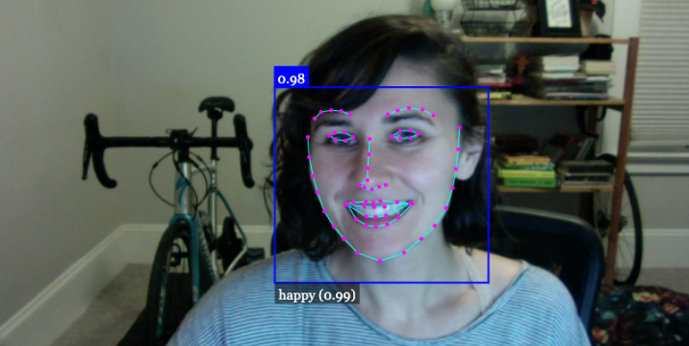

# Facial Mood Detection Application

This JS program uses the FaceAPI library to detect facial features and expressions in a live video stream from a user's webcam. It can identify faces, expressions, and a subject's landmarks in real-time. Below are the key components and functionalities of the program.

## Prerequisites

Before running the program, make sure to load the necessary models using the `Promise.all` method. These models include:
- Tiny Face Detector
- Face Landmark 68
- Face Recognition
- Face Expression

## Getting Started

To start the program, you need to access the user's webcam and stream it to an HTML `<video>` element. This is achieved through the `startVideo` function, which hooks up the webcam to the video element.

```javascript
// hook up webcam to video element
function startVideo() {
    navigator.getUserMedia(
        { video: {} },
        stream => video.srcObject = stream,
        err => console.log(err)
    );
}
```

## Facial Detection and Visualization

The program constantly analyzes the video stream for faces, landmarks, and expressions. This is done in the event listener attached to the `play` event of the video element.

- A canvas element is created to overlay the video and draw the facial features and expressions.
- The display size of the video is obtained, and the canvas is matched to this size.
- The `setInterval` function is used to repeatedly detect faces, landmarks, and expressions and update the canvas every 100 milliseconds.

```javascript
video.addEventListener('play', () => {
    const canvas = faceapi.createCanvasFromMedia(video);
    document.body.append(canvas);
    const displaySize = {
        width: video.width,
        height: video.height
    };
    faceapi.matchDimensions(canvas, displaySize);

    setInterval(async () => {
        const detections = await faceapi.detectAllFaces(video, new faceapi.TinyFaceDetectorOptions())
            .withFaceLandmarks()
            .withFaceExpressions();

        // Clear the canvas
        canvas.getContext('2d').clearRect(0, 0, canvas.width, canvas.height);

        // Draw detected elements on the canvas
        const resizedDetections = faceapi.resizeResults(detections, displaySize);
        faceapi.draw.drawDetections(canvas, resizedDetections);
        faceapi.draw.drawFaceLandmarks(canvas, resizedDetections);
        faceapi.draw.drawFaceExpressions(canvas, resizedDetections);
    }, 100);
});
```

## Usage

1. Load this JavaScript program into your HTML file.
2. Make sure to include the necessary FaceAPI library and models.
3. Access the webpage in a browser that supports webcams.
4. Grant necessary permissions to access your webcam.
5. The program will display the live video stream with facial feature and expression detection overlaid on it.

Enjoy real-time facial mood detection with this program!

**Note:** This program serves as a simple demonstration of facial detection and expression recognition. You can further enhance it by integrating more advanced features and user interactions.

**Remember to cite and credit the FaceAPI library if you use it in your project.**

For more information on FaceAPI, refer to their official documentation: [FaceAPI GitHub Repository](https://github.com/justadudewhohacks/face-api.js).

<!---->
